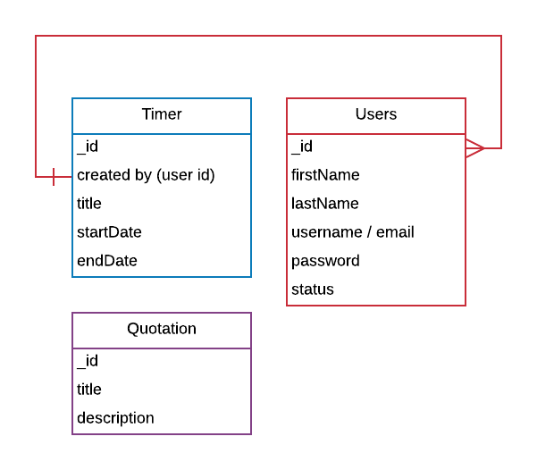
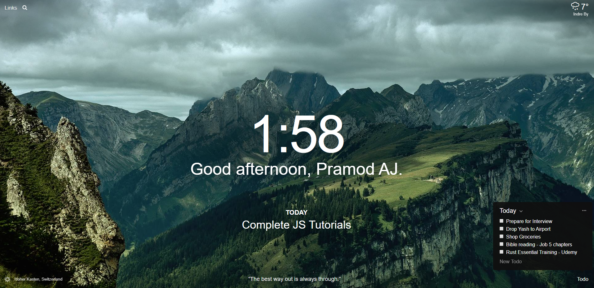

# Time Travel

<div style="width:100; text-align:center">
    </a>
</div>

This is an online **Progressive Web Application**. 
Users can login using Google / Facebook / Gtihub. 
They can create Checklist / Todo list for perhaps travel / study / grocery...etc.,

It also will have a `Days-Hours-Minutes-Seconds` timer. Users can switch between `Count-up` / `Count-down` timers.



## Important Links
- [Adobe Color Wheel](https://color.adobe.com/create)\
- [Material UI 4.2.6 Palette Ganerator](https://in-your-saas.github.io/material-ui-theme-editor/)
- [Material UI Docs Site](https://material-ui.com/customization/themes/#palette)
- [Firebase MUI Theme - Paperbase](https://material-ui.com/store/items/paperbase/)

## Tech Stack

- **MEAN** / **MERN** stack. Typescript must.
- Heroku Hosting
- Mongo Lab / Mongo Atlas
- Node + Express / Nest JS
- Jest Unit Testing
- Swagger
- Yarn Package Manager (Both `create-react-app` adn )
- GSAP Animation library
- Font Family [Satisfy](https://fonts.google.com/?selection.family=Satisfy)

## Features

- Users can use the `Todo List/Checklist` independently
- Users can drag the checklist around
- Users can use the `Timer` independently
- Or they can map a `Countdown` timer to a checklist 
- The application will notify them of the checklist / task once the countdown timer reaches zero

---

## Scope

### In Scope

- Todo list
- OAuth 2.0
- Countdown Timer
- User Profile
- Provide description of checklist, timer..etc.,

### Out of Scope

- Any File Upload
- Image Upload

---

## References



- [Online Countdown timer](https://tech-card.herokuapp.com/admin/#/timer)
- [Online Todo list / Checklist](https://kanban-chi.appspot.com/dashboard/5722649325731840/d-5722649325731840)
- [Complete OAuth 2.0 Auth Module using Nest JS](https://github.com/bojidaryovchev/nest-angular/tree/master/)
    - Auth Module located in `src/server/modules/auth/`
    - Support for Strategies - `Google OAuth 2.0, Facebook, Twitter, Local`

---

## Installing using Yarn

You need the latest version of Yarn installed, for more details. Please check the following links.

- [Travery Media Youtube link](https://www.youtube.com/watch?v=g9_6KmiBISk)
- [YARN official Documentation site](https://yarnpkg.com/)
- [Travery Media Website](https://www.traversymedia.com/)
- [YARN Windows Installer](https://classic.yarnpkg.com/en/docs/install#windows-stable)

### For Nest JS

```bash
# Setup yarn from the cli that Nest JS provides
C:\> nest new backend
Which package manager will you require ?
- yarn
```

### For Create-react-app

- [For more info](https://create-react-app.dev/docs/getting-started/)

```bash
# setup using yarn
yarn create react-app frontend
```

# Font family

## Satisfy

[Google Fonts Link](https://fonts.google.com/?selection.family=Satisfy)

```html
<link href="https://fonts.googleapis.com/css?family=Satisfy&display=swap" rel="stylesheet">
```

```css
<style>
@import url('https://fonts.googleapis.com/css?family=Satisfy&display=swap');
</style>
```

```css
font-family: 'Satisfy', cursive, sans-serif;]'\K,1QAS\ L .
```

# Material Theme Configuration

- The Theme Palette is taken from [Adobe Color Wheel](https://color.adobe.com/explore?page=2)
- The Below Gradients for Primary & Secondary have been taken from the [MUI Palette Generator](https://in-your-saas.github.io/material-ui-theme-editor/)

## Primary Color Gradient

```css
/* Color Theme Swatches in Hex */
.Azules-1-hex { color: #0A2459; }
.Azules-2-hex { color: #0D2F73; }
.Azules-3-hex { color: #16558C; }
.Azules-4-hex { color: #147CA6; }
.Azules-5-hex { color: #36B1BF; }

/* Color Theme Swatches in RGBA */
.Azules-1-rgba { color: rgba(10, 36, 89, 1); }
.Azules-2-rgba { color: rgba(13, 47, 115, 1); }
.Azules-3-rgba { color: rgba(22, 85, 140, 1); }
.Azules-4-rgba { color: rgba(20, 124, 166, 1); }
.Azules-5-rgba { color: rgba(54, 177, 191, 1); }
```

## Secondary Color Gradient

```css
/* Color Theme Swatches in Hex */
.My-Color-Theme-1-hex { color: #B80F4F; }
.My-Color-Theme-2-hex { color: #380418; }
.My-Color-Theme-3-hex { color: #C34A79; }
.My-Color-Theme-4-hex { color: #381523; }
.My-Color-Theme-5-hex { color: #850B39; }

/* Color Theme Swatches in RGBA */
.My-Color-Theme-1-rgba { color: rgba(184, 15, 79, 1); }
.My-Color-Theme-2-rgba { color: rgba(56, 4, 24, 1); }
.My-Color-Theme-3-rgba { color: rgba(195, 74, 121, 1); }
.My-Color-Theme-4-rgba { color: rgba(56, 21, 35, 1); }
.My-Color-Theme-5-rgba { color: rgba(133, 11, 57, 1); }
```

Using the Above Colors, The Palette JSON is as follows:

```json
{"palette":{"common":{"black":"#000","white":"#fff"},"background":{"paper":"#fff","default":"rgba(244, 244, 244, 1)"},"primary":{"light":"rgba(20, 124, 166, 1)","main":"rgba(22, 85, 140, 1)","dark":"rgba(10, 36, 89, 1)","contrastText":"#fff"},"secondary":{"light":"rgba(240, 52, 122, 1)","main":"rgba(184, 15, 79, 1)","dark":"rgba(133, 11, 57, 1)","contrastText":"#fff"},"error":{"light":"rgba(255, 64, 64, 1)","main":"rgba(217, 54, 54, 1)","dark":"rgba(128, 44, 67, 1)","contrastText":"#fff"},"text":{"primary":"rgba(0, 0, 0, 0.87)","secondary":"rgba(0, 0, 0, 0.54)","disabled":"rgba(0, 0, 0, 0.38)","hint":"rgba(0, 0, 0, 0.38)"}}}
```

The Final Theme Palette JSON for MUI version 4.2.1 is as follows:

```js
let theme = createMuiTheme({
        palette: {
            "common": {
                "black": "#000",
                "white": "#fff"
            },
            "background": {
                "paper": "#fff",
                "default": "rgba(244, 244, 244, 1)"
            },
            "primary": {
                "light": "rgba(20, 124, 166, 1)",
                "main": "rgba(22, 85, 140, 1)",
                "dark": "rgba(10, 36, 89, 1)",
                "contrastText": "#fff"
            },
            "secondary": {
                "light": "rgba(240, 52, 122, 1)",
                "main": "rgba(184, 15, 79, 1)",
                "dark": "rgba(133, 11, 57, 1)",
                "contrastText": "#fff"
            },
            "error": {
                "light": "rgba(255, 64, 64, 1)",
                "main": "rgba(217, 54, 54, 1)",
                "dark": "rgba(128, 44, 67, 1)",
                "contrastText": "#fff"
            },
            "text": {
                "primary": "rgba(0, 0, 0, 0.87)",
                "secondary": "rgba(0, 0, 0, 0.54)",
                "disabled": "rgba(0, 0, 0, 0.38)",
                "hint": "rgba(0, 0, 0, 0.38)"
            }
        },
        typography: {
          fontFamily: ['"Montserrat"' , 'sans-serif'].join(','), 
          fontSize: 16,
          h5: {
            fontWeight: 500,
            fontSize: 26,
            letterSpacing: 0.5,
          },
        },
        shape: {
          borderRadius: 8,
        },
        props: {
          MuiTab: {
            disableRipple: true,
          },
        },
        mixins: {
          toolbar: {
            minHeight: 48,
          },
        }
    });
```